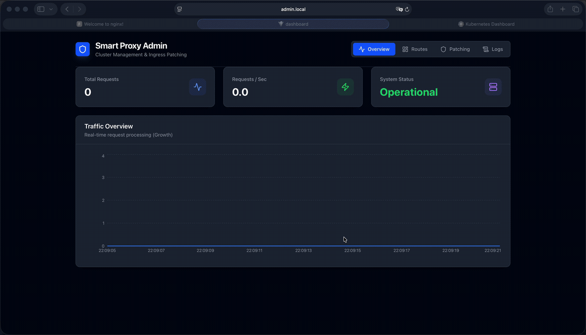

<div align="center">


# Smart Proxy

### Scale-to-zero and smart traffic management for Kubernetes & OpenShift — *without touching your apps.*

[](https://artifacthub.io/packages/helm/smart-proxy/smart-proxy)
[](https://hub.docker.com/r/isebben/smart-proxy)
[](https://ivseb.github.io/smart-proxy)
[](LICENSE)
[](https://github.com/ivseb/smart-proxy/releases)
[](https://ivseb.github.io/smart-proxy/)



</div>

---

## Why Smart Proxy?

Idle environments burn money. Preview, dev, staging and demo namespaces sit running 24/7 while nobody looks at them — and most apps can't scale to zero on their own.

**Smart Proxy fixes that.** It sits in front of your services, puts inactive Deployments to **sleep (0 replicas)**, and **wakes them on the first request** — showing a friendly "waking up" page while the pod starts. It does this by patching your *existing* Ingress or Route, so there are **no sidecars, no rewrites, and no code changes**. Flip it off and everything reverts.

## ✨ Highlights

| | |
| :--- | :--- |
| 💤 **Auto-sleep & instant wake** | Scale idle deployments to zero; the next request transparently wakes them back up. |
| 🔗 **Dependency chains** | Keep `app → api → db` awake together and let them sleep together. Traffic to one keeps the chain alive. |
| 🔀 **Ingress *and* Routes** | One dashboard for both vanilla Kubernetes Ingresses and OpenShift Routes. |
| 🎛️ **Admin dashboard** | A modern React UI with real-time logs, status and one-click patching. |
| 🪶 **Zero app changes** | Fully annotation-based and reversible — nothing to add to your images. |

## 🎬 How it works

1. **Patch** a route from the dashboard → Smart Proxy points the Ingress/Route to itself (originals saved in annotations).
2. **Serve** → incoming traffic hits Smart Proxy, which checks the target's state.
3. **Wake** → if the deployment is asleep, it holds the request, scales it up, and shows a "waking up" page until ready.
4. **Sleep** → after an idle timeout with no traffic, it scales the deployment back to zero.

See the [Architecture overview](docs/architecture.md) for the details.

## 🚀 Quick start

**On Kubernetes / OpenShift (Helm):**

```bash
helm repo add smart-proxy https://ivseb.github.io/smart-proxy
helm install smart-proxy smart-proxy/smart-proxy --namespace smart-proxy --create-namespace
```

**Try it locally (Docker Desktop + Kubernetes):**

```bash
./scripts/setup-local.sh
```

Then open the dashboard at [http://admin.local](http://admin.local) *(add `127.0.0.1 admin.local` to your `/etc/hosts`)*.

## 📦 Great for

- **Preview / PR environments** that spin up per branch and sit idle most of the day
- **Dev & staging** clusters where cost matters more than always-on latency
- **Internal tools & dashboards** used a few times a week
- **Demo environments** that should wake up the moment someone visits

## 📚 Documentation

- [Installation Guide](docs/installation.md) — Helm, from source, and all values
- [Architecture Overview](docs/architecture.md) — how patching, waking and dependencies work
- [Configuration Reference](docs/configuration.md) — environment variables and annotations

## 🤝 Contributing

Issues and pull requests are welcome. If Smart Proxy saves you some cluster bills, a ⭐ on GitHub is appreciated!

## License

Released under the [MIT License](LICENSE).
