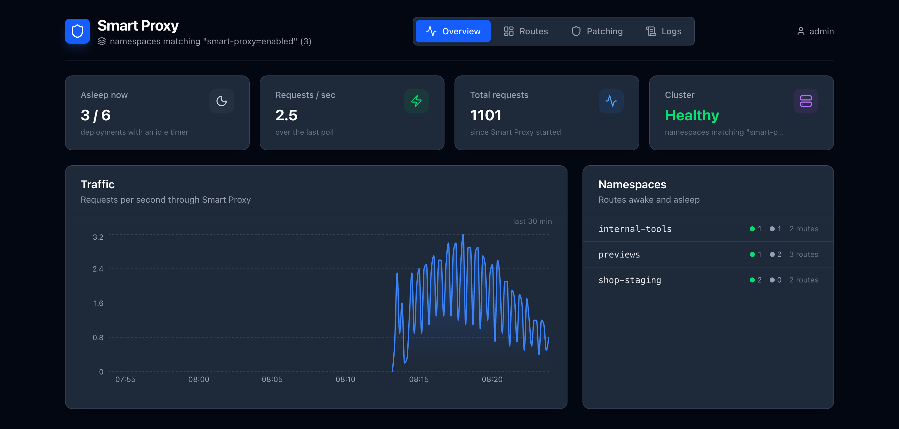
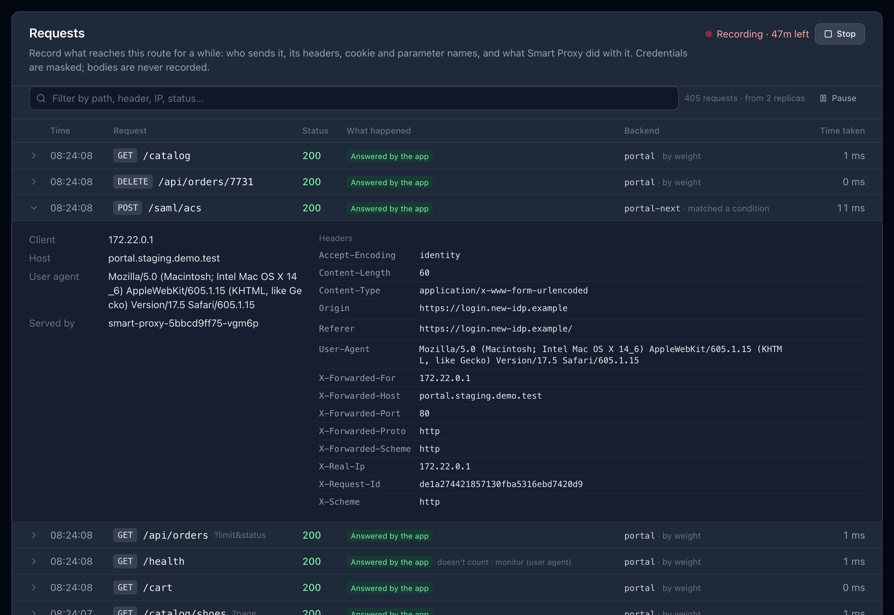
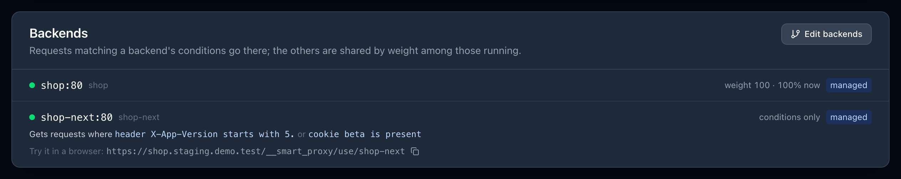
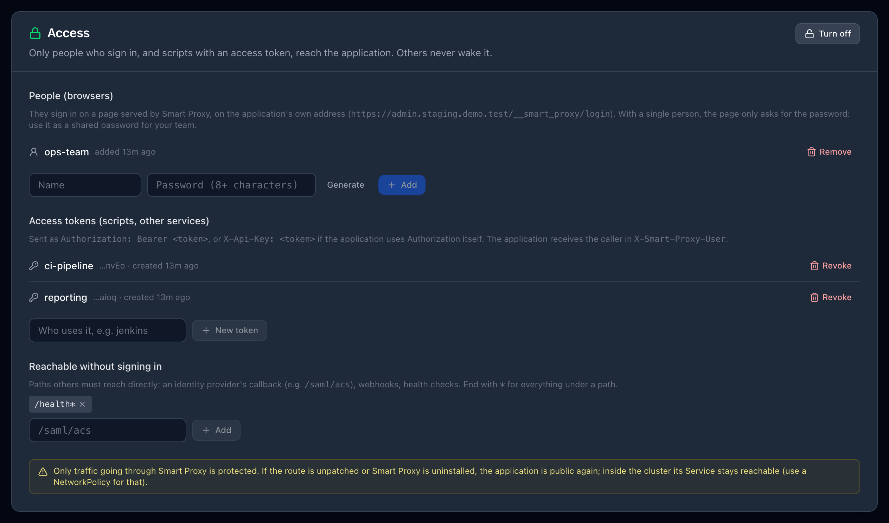
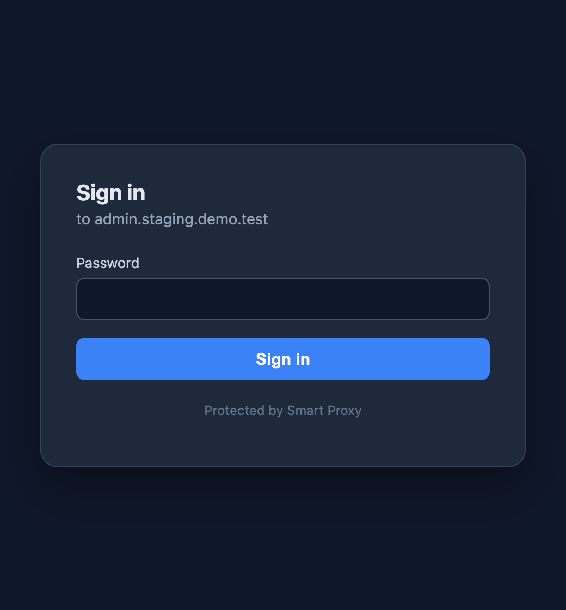

<div align="center">


# Smart Proxy

### Scale-to-zero and smart traffic management for Kubernetes & OpenShift — *without touching your apps.*

[](https://artifacthub.io/packages/helm/smart-proxy/smart-proxy)
[](https://hub.docker.com/r/isebben/smart-proxy)
[](https://ivseb.github.io/smart-proxy)
[](LICENSE)
[](https://github.com/ivseb/smart-proxy/releases)
[](https://ivseb.github.io/smart-proxy/)


</div>

---

## Why Smart Proxy?

Idle environments burn money. Preview, dev, staging and demo namespaces sit running 24/7 while nobody looks at them — and most apps can't scale to zero on their own.

**Smart Proxy fixes that.** It sits in front of your services, puts inactive Deployments to **sleep (0 replicas)**, and **wakes them on the first request** — showing a friendly "waking up" page while the pod starts. It does this by patching your *existing* Ingress or Route, so there are **no sidecars, no rewrites, and no code changes**. Flip it off and everything reverts.

## ✨ Highlights

| | |
| :--- | :--- |
| 💤 **Auto-sleep & instant wake** | Scale idle deployments to zero; the next request transparently wakes them back up. |
| 🔗 **Dependency chains** | Keep `app → api → db` awake together, optionally starting them in order, and let them sleep together. |
| 🩺 **Monitor-aware** | Uptime monitors and health checks never keep apps awake or wake them; they get a 200 while apps sleep. See who keeps an app awake and ignore it in one click. |
| 🔍 **Requests inspector** | Record what reaches a route for a few minutes: headers (credentials masked), cookies, and what Smart Proxy did with each request. |
| 🧪 **Try a new version with some users** | Send requests matching a condition (a header, cookie, path, client IP…) to another backend and keep those users there — e.g. the beta of your mobile app on the next version of the API. |
| 🔒 **Built-in sign-in** | Put any app behind a sign-in page or access tokens, without an identity provider and without touching the app. |
| 🗓️ **Schedules** | Keep apps awake during office hours (any timezone) and let them sleep the rest of the time. |
| 📈 **Prometheus metrics** | Cold-start durations, wake-ups, sleeping deployments and replica-hours saved. |
| 🔀 **Ingress *and* Routes** | One dashboard for both vanilla Kubernetes Ingresses and OpenShift Routes. |
| 🗂️ **Many namespaces** | Manage a list of namespaces, all of them, or any namespace you label `smart-proxy=enabled`. |
| 🎛️ **Admin dashboard** | Routes grouped by namespace with search and filters, live status and "sleeps in" timers, one-click patching, wake and sleep. |
| 🔐 **Secure by default** | Dashboard sign-in with basic auth, tokens, SSO via OIDC (Keycloak, Entra ID, Google…) or OpenShift login. |
| 🛡️ **Built for production** | Two replicas with leader election, WebSockets and streams, gRPC, bursts of requests sharing one wake-up, GitOps-aware self-healing — tested end to end on a real cluster. |
| 🪶 **Zero app changes** | Fully annotation-based and reversible — nothing to add to your images. Opt in from the dashboard or with annotations in Git. |

## 🖥️ The dashboard

Traffic of the last 30 minutes and what sleeps, at a glance:



Patch Ingresses and Routes in one click, across namespaces:


The dashboard, the "waking up" page and the sign-in page speak **English and Italian**, following the browser's language (the dashboard has a switch in its header).

## 🧰 More than sleeping

Three optional tools on each route's page — routes that don't use them work as before. [Read more →](docs/routes.md)

**See what arrives.** Record a route's requests for a few minutes: who sends them, their headers (credentials masked), and what Smart Proxy did with each — answered by the app, woke it first, showed the waking page, which backend got it and why.



**Try a new version with some users.** Give a route a second backend and the conditions that send requests to it — here, the beta of the mobile app, recognized by its `X-App-Version` header. Those users stay on the new version for the rest of their session; everyone else keeps the current one. **Route like this…** on a recorded request turns one of its headers into a condition.



**Require sign-in or a token.** Put an application behind a sign-in page served on its own address (a shared password, or named people) and access tokens for scripts — no identity provider needed. The application gets the caller in `X-Smart-Proxy-User`; strangers never wake it.

<p>
  
  
</p>

## 🎬 How it works

1. **Patch** a route from the dashboard → Smart Proxy points the Ingress/Route to itself (originals saved in annotations).
2. **Serve** → incoming traffic hits Smart Proxy, which checks the target's state.
3. **Wake** → if the deployment is asleep, it scales it up: browsers see a "waking up" page until it's ready, API calls and WebSockets simply wait for it.
4. **Sleep** → after an idle timeout with no traffic, it scales the deployment back to zero.

<p align="center">
  
</p>

See the [Architecture overview](docs/architecture.md) for the details.

## 🚀 Quick start

**On Kubernetes / OpenShift (Helm):**

```bash
helm repo add smart-proxy https://ivseb.github.io/smart-proxy
helm install smart-proxy smart-proxy/smart-proxy --namespace smart-proxy --create-namespace
```

The dashboard is protected with a generated password by default (user `admin`):

```bash
kubectl get secret -n smart-proxy smart-proxy-auth -o jsonpath='{.data.basic-password}' | base64 -d
```

Prefer single sign-on? Switch to OIDC or OpenShift login, see [Authentication](docs/authentication.md).

**Try it locally (Docker Desktop + Kubernetes):**

```bash
./scripts/setup-local.sh
```

Then open the dashboard at [http://admin.local](http://admin.local) *(add `127.0.0.1 admin.local` to your `/etc/hosts`)*.

## 📦 Great for

- **Preview / PR environments** that spin up per branch and sit idle most of the day
- **Dev & staging** clusters where cost matters more than always-on latency
- **Internal tools & dashboards** used a few times a week
- **Demo environments** that should wake up the moment someone visits

## 📚 Documentation

- [Installation Guide](docs/installation.md) — Helm, from source, and all values
- [Architecture Overview](docs/architecture.md) — how patching, waking and dependencies work
- [Configuration Reference](docs/configuration.md) — environment variables and annotations
- [Upgrading](docs/upgrading.md) — what changes from one version to the next
- [Changelog](CHANGELOG.md)
- [Inspect, route, protect](docs/routes.md) — record what reaches a route, send some requests to another backend (e.g. a beta), require sign-in or an access token
- [GitOps](docs/gitops.md) — configure routes with annotations; Argo CD and Flux settings
- [Authentication](docs/authentication.md) — securing the dashboard with basic, token, OIDC/SSO or OpenShift login

## 🤝 Contributing

Issues and pull requests are welcome. If Smart Proxy saves you some cluster bills, a ⭐ on GitHub is appreciated!

`go test -race ./...` runs the unit tests. `test/e2e/run.sh` runs the end-to-end tests on a local [kind](https://kind.sigs.k8s.io) cluster (Docker, kind, kubectl and Helm needed): through ingress-nginx, waking from a browser, API calls with large bodies, bursts of requests, WebSockets, gRPC-style HTTP/2, the requests inspector, backend conditions, sign-in and tokens, long streams, leader failover and uninstall. CI runs both.

## License

Released under the [MIT License](LICENSE).
