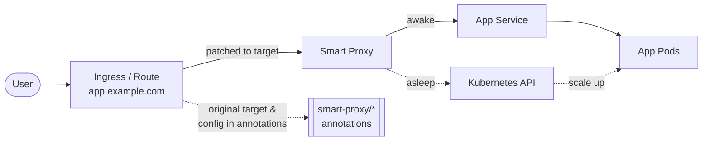
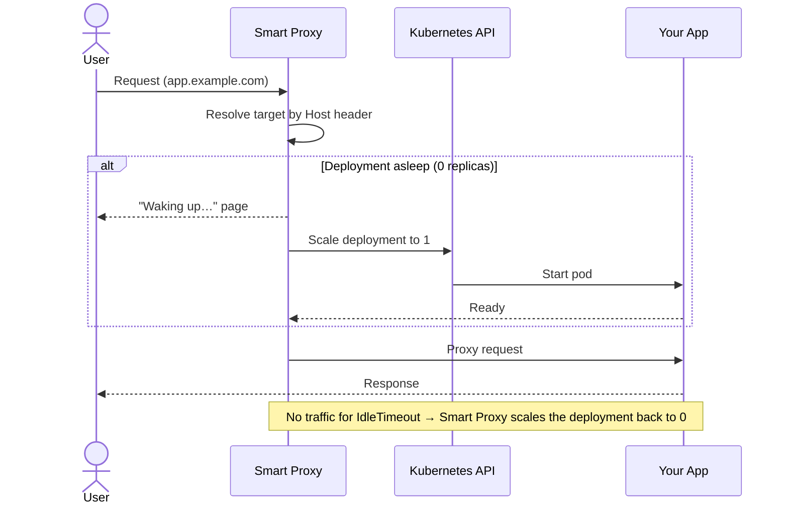
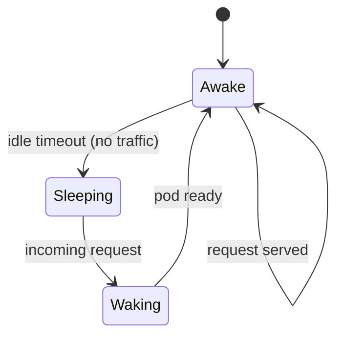
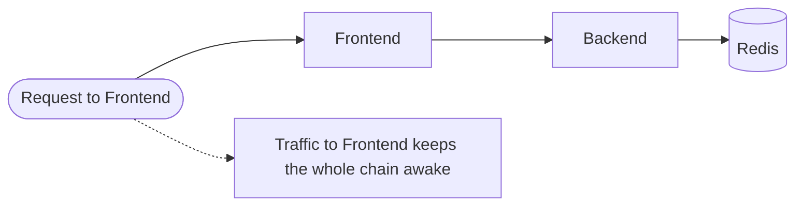

# Architecture

Smart Proxy acts as a transparent intermediary in front of your Kubernetes **Ingresses** and OpenShift **Routes**. When you "patch" a route, its traffic is redirected through Smart Proxy, which can then put the target deployment to sleep and wake it on demand.

## Traffic flow

Once a route is patched, the Ingress/Route no longer points at your application service directly — it points at Smart Proxy, which forwards traffic (and wakes the workload if it's asleep). The original target is preserved in annotations so the change is fully reversible.

## Request lifecycle

Every request is inspected. If the target deployment is scaled to zero, Smart Proxy holds the request, scales it up, shows a "waking up" page, and proxies through once the pod is ready.

## Sleep / wake states

A deployment moves between three states driven purely by traffic and an inactivity timer.

## Dependency chains

A route can declare dependencies. Smart Proxy makes sure the whole chain is awake before forwarding traffic, and keeps it alive as long as the entry point is being used. When the entry point goes idle, dependencies can optionally sleep too.

## Under the hood

1.  **Patching** — patching a route via the Admin UI rewrites the Ingress/Route to point at the `smart-proxy` service. The original service/port is stored in the `smart-proxy/original-service` and `smart-proxy/original-port` annotations, and `smart-proxy/patched` is set to `true`. Advanced settings (dependencies, timeouts) live in `smart-proxy/config`.
2.  **Request handling** — traffic hits Smart Proxy, which uses the `Host` header to find the matching configuration.
3.  **Idle detection** — if the target is scaled to zero, the request is held while the deployment scales up and a "waking up" page is shown. An inactivity timer scales it back to zero once traffic stops.
4.  **Dependencies** — dependent services are started before traffic is forwarded; using one service keeps the entire chain alive, and dependencies can optionally be stopped together when idle.
