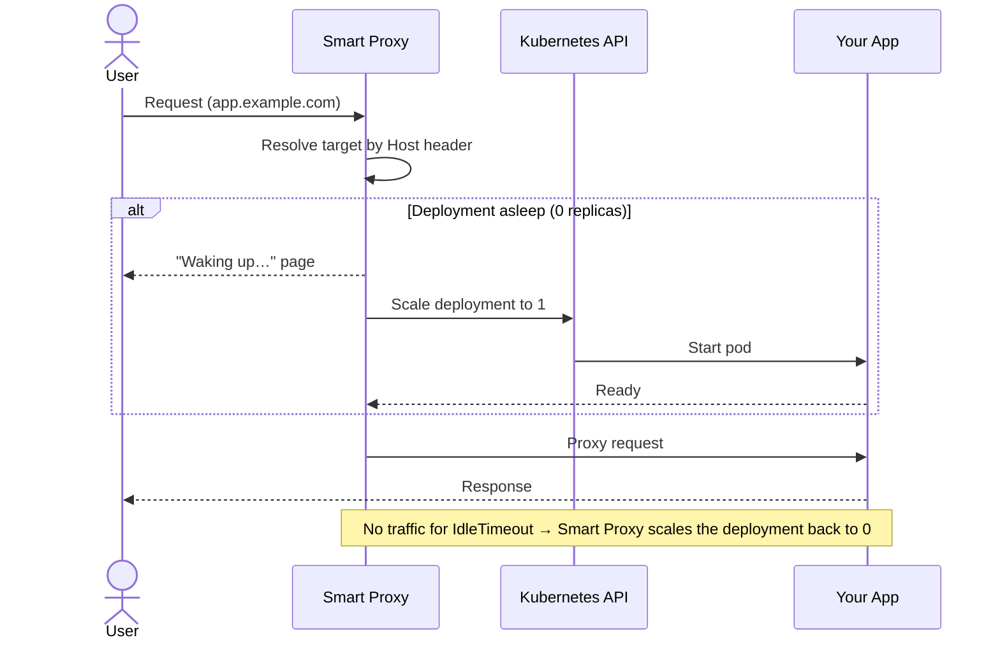
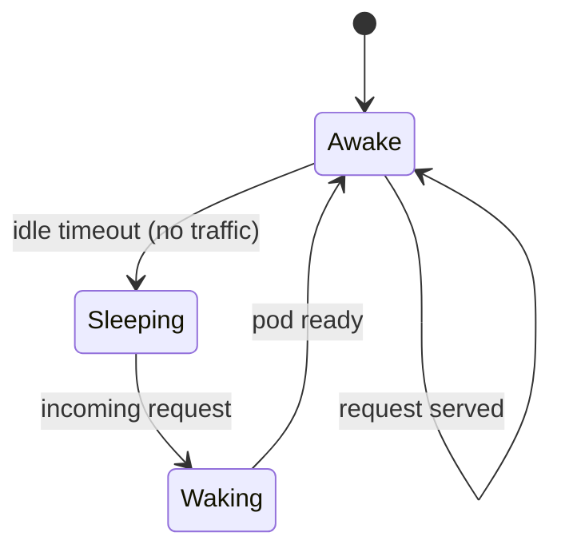
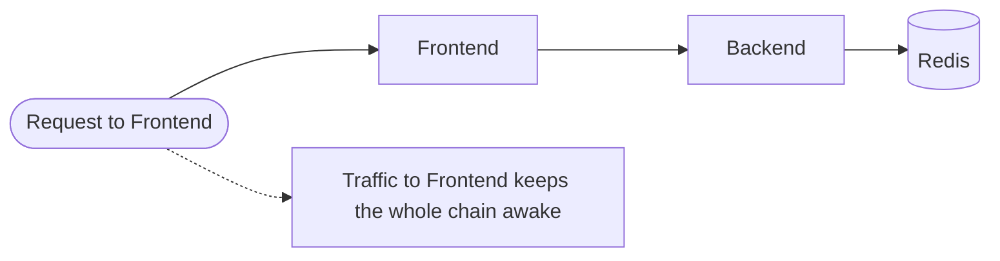

# Architecture

Smart Proxy acts as a transparent intermediary in front of your Kubernetes **Ingresses** and OpenShift **Routes**. When you "patch" a route, its traffic is redirected through Smart Proxy, which can then put the target deployment to sleep and wake it on demand.

## Traffic flow

Once a route is patched, the Ingress/Route no longer points at your application service directly — it points at Smart Proxy, which forwards traffic (and wakes the workload if it's asleep). The original target is preserved in annotations so the change is fully reversible.

```mermaid
flowchart LR
    U([User]) --> ING["Ingress / Route<br/>app.example.com"]
    ING -->|patched to target| SP["Smart Proxy"]
    SP -->|awake| SVC["App Service"] --> POD["App Pods"]
    SP -. asleep .-> API["Kubernetes API"]
    API -. scale up .-> POD
    ING -.->|original target &<br/>config in annotations| ANN[["smart-proxy/*<br/>annotations"]]
```

## Request lifecycle

Every request is inspected. If the target deployment is scaled to zero, Smart Proxy holds the request, scales it up, shows a "waking up" page, and proxies through once the pod is ready.

```mermaid
sequenceDiagram
    actor User
    participant SP as Smart Proxy
    participant API as Kubernetes API
    participant App as Your App
    User->>SP: Request (app.example.com)
    SP->>SP: Resolve target by Host header
    alt Deployment asleep (0 replicas)
        SP-->>User: "Waking up…" page
        SP->>API: Scale deployment to 1
        API->>App: Start pod
        App-->>SP: Ready
    end
    SP->>App: Proxy request
    App-->>User: Response
    Note over SP,App: No traffic for IdleTimeout → Smart Proxy scales the deployment back to 0
```

## Sleep / wake states

A deployment moves between three states driven purely by traffic and an inactivity timer.

```mermaid
stateDiagram-v2
    [*] --> Awake
    Awake --> Sleeping: idle timeout (no traffic)
    Sleeping --> Waking: incoming request
    Waking --> Awake: pod ready
    Awake --> Awake: request served
```

## Dependency chains

A route can declare dependencies. Smart Proxy makes sure the whole chain is awake before forwarding traffic, and keeps it alive as long as the entry point is being used. When the entry point goes idle, dependencies can optionally sleep too.

```mermaid
flowchart LR
    R([Request to Frontend]) --> FE[Frontend]
    FE --> BE[Backend]
    BE --> DB[(Redis)]
    note["Traffic to Frontend keeps the whole chain awake"]
    R -.-> note
```

## Under the hood

1.  **Patching** — patching a route via the Admin UI rewrites the Ingress/Route to point at the Smart Proxy service (its `proxy` port, by name). The original service/port is stored in the `smart-proxy/original-service` and `smart-proxy/original-port` annotations, and `smart-proxy/patched` is set to `true`. Advanced settings (dependencies, timeouts) live in `smart-proxy/config`.
2.  **Request handling** — traffic hits Smart Proxy, which uses the `Host` header to find the matching configuration.
3.  **Idle detection** — if the target is scaled to zero, the request is held while the deployment scales up and a "waking up" page is shown. An inactivity timer scales it back to zero once traffic stops (30 minutes unless the route sets its own timeout).
4.  **Wake-up size** — before sleeping, the replica count is saved in the Deployment's `smart-proxy/replicas-before-sleep` annotation, and waking restores it. If a HorizontalPodAutoscaler manages the Deployment, it wakes at the HPA's `minReplicas` instead, and the HPA takes over from there. Kubernetes pauses an HPA while its target is at zero replicas, so the two don't conflict. Deployments managed by **KEDA** are never put to sleep: KEDA would scale them straight back up. Use KEDA's own scale-to-zero for those.
5.  **Dependencies** — dependent services are started together with the application by default. With *Start in order*, they start one at a time in the listed order, each once the previous one has a ready replica, and the application last (e.g. database, then API, then frontend). Using one service keeps the entire chain alive, and dependencies can optionally be stopped together when idle.

## High availability

Patched applications receive their traffic through Smart Proxy, so the chart runs two replicas by default (with a PodDisruptionBudget and spreading across nodes). The replicas work as one:

- **Shared routes.** Route configurations live in the `<release>-routes` ConfigMap; every replica watches it, so a change made through any dashboard reaches all of them within a second. (Older versions kept them in `/data/routes.json`; such a file is imported on the first start.)
- **Shared activity.** Each replica serves only part of the traffic. Every 15 seconds it publishes the last request time it saw for each route, plus its request counts, in a small ConfigMap owned by its pod (deleted with it). Replicas merge each other's activity, so idle timers and dashboard numbers cover all traffic.
- **One leader.** Replicas elect a leader through the `<release>-leader` Lease. Only the leader puts deployments to sleep and re-applies reverted patches; if it goes away, another replica takes over within seconds. Every replica proxies requests and wakes deployments.

Each replica streams only its own logs to the dashboard.

