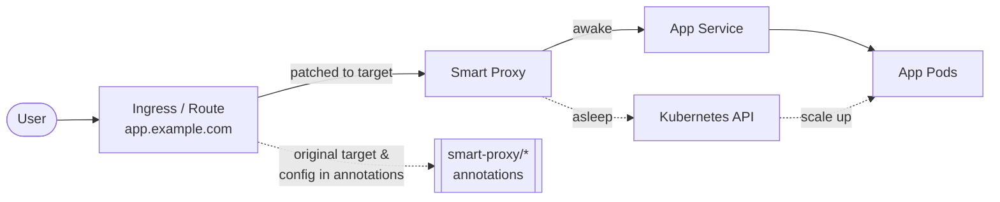
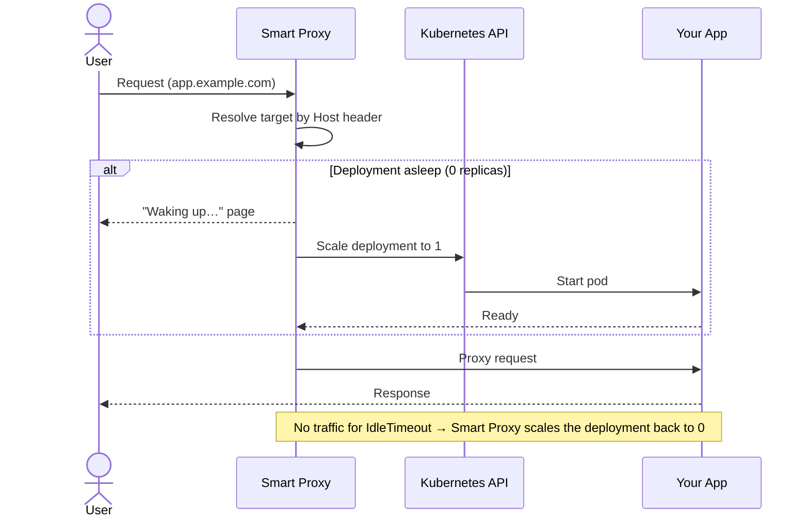
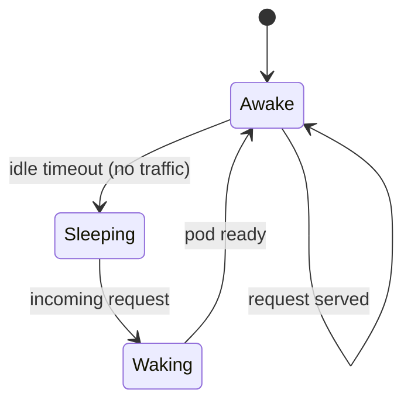

# Architecture

Smart Proxy acts as a transparent intermediary in front of your Kubernetes **Ingresses** and OpenShift **Routes**. When you "patch" a route, its traffic is redirected through Smart Proxy, which can then put the target deployment to sleep and wake it on demand.

## Traffic flow

Once a route is patched, the Ingress/Route no longer points at your application service directly — it points at Smart Proxy, which forwards traffic (and wakes the workload if it's asleep). The original target is preserved in annotations so the change is fully reversible.

```mermaid
flowchart LR
    U([User]) --> ING["Ingress / Route<br/>app.example.com"]
    ING -->|patched to target| SP["Smart Proxy"]
    SP -->|awake| SVC["App Service"] --> POD["App Pods"]
    SP -. asleep .-> API["Kubernetes API"]
    API -. scale up .-> POD
    ING -.->|original target &<br/>config in annotations| ANN[["smart-proxy/*<br/>annotations"]]
```

## Request lifecycle

Every request is inspected. If the target deployment is scaled to zero, Smart Proxy holds the request, scales it up, shows a "waking up" page, and proxies through once the pod is ready.

```mermaid
sequenceDiagram
    actor User
    participant SP as Smart Proxy
    participant API as Kubernetes API
    participant App as Your App
    User->>SP: Request (app.example.com)
    SP->>SP: Resolve target by Host header
    alt Deployment asleep (0 replicas)
        SP-->>User: "Waking up…" page
        SP->>API: Scale deployment to 1
        API->>App: Start pod
        App-->>SP: Ready
    end
    SP->>App: Proxy request
    App-->>User: Response
    Note over SP,App: No traffic for IdleTimeout → Smart Proxy scales the deployment back to 0
```

## Sleep / wake states

A deployment moves between three states driven purely by traffic and an inactivity timer.

```mermaid
stateDiagram-v2
    [*] --> Awake
    Awake --> Sleeping: idle timeout (no traffic)
    Sleeping --> Waking: incoming request
    Waking --> Awake: pod ready
    Awake --> Awake: request served
```

## Dependency chains

A route can declare dependencies. Smart Proxy makes sure the whole chain is awake before forwarding traffic, and keeps it alive as long as the entry point is being used. When the entry point goes idle, dependencies can optionally sleep too.

```mermaid
flowchart LR
    R([Request to Frontend]) --> FE[Frontend]
    FE --> BE[Backend]
    BE --> DB[(Redis)]
    note["Traffic to Frontend keeps the whole chain awake"]
    R -.-> note
```

## Under the hood

1.  **Patching** — patching a route via the Admin UI rewrites the Ingress/Route to point at the Smart Proxy service (its `proxy` port, by name). The original service/port is stored in the `smart-proxy/original-service` and `smart-proxy/original-port` annotations, and `smart-proxy/patched` is set to `true`. Advanced settings (dependencies, timeouts) live in `smart-proxy/config`.
2.  **Request handling** — traffic hits Smart Proxy, which uses the `Host` header to find the matching configuration.
3.  **Idle detection** — if the target is scaled to zero, the deployment is scaled up. Browsers get a "waking up" page that reloads once the app is ready; API calls, form posts and WebSockets are held until it is ready and then proxied (or get `503` after `WAKE_TIMEOUT`). Open WebSockets and streams count as activity for as long as they last. An inactivity timer scales it back to zero once traffic stops (30 minutes unless the route sets its own timeout).
4.  **Wake-up size** — before sleeping, the replica count is saved in the Deployment's `smart-proxy/replicas-before-sleep` annotation, and waking restores it. If a HorizontalPodAutoscaler manages the Deployment, it wakes at the HPA's `minReplicas` instead, and the HPA takes over from there. Kubernetes pauses an HPA while its target is at zero replicas, so the two don't conflict. Deployments managed by **KEDA** are never put to sleep: KEDA would scale them straight back up. Use KEDA's own scale-to-zero for those.
5.  **Dependencies** — dependent services are started together with the application by default. With *Start in order*, they start one at a time in the listed order, each once the previous one has a ready replica, and the application last (e.g. database, then API, then frontend). Using one service keeps the entire chain alive, and dependencies can optionally be stopped together when idle.

## Routes balancing several Services

An OpenShift Route can split traffic across Services by weight (`alternateBackends`), for A/B tests, canaries, or a backend kept off and only turned on for special cases. The OpenShift router skips backends with no running pods.

When such a Route is patched, Smart Proxy takes over the split and keeps that behaviour:

- Traffic is balanced by the Route's weights across the backends that are **running**; a client keeps its backend (a cookie, like the router's).
- Only **managed** backends are woken up and put to sleep with the application. The others are never touched: a backend kept off on purpose stays off, and gets its share again as soon as you turn it on.
- By default the backends running when the Route is patched are managed. Change it in the route form ("Sleep & wake with the app"), or with the `smart-proxy/managed-backends` annotation.
- If the managed backends are asleep but another backend is running, it answers right away while they wake up, so nobody waits.

Unpatching restores the Route's original split and port exactly.

## Uptime monitors and health checks

Uptime monitors and health checks poll applications around the clock. Counted as activity, they would keep environments awake forever, and wake them right back up after they go to sleep. Smart Proxy recognizes them and treats them differently:

- **They never count as activity**, so they don't keep an application awake.
- **They never wake an application.** While it sleeps, they get an answer from Smart Proxy itself: by default `200 OK` (the monitor stays green), or `503` (the monitor reports it down), or, if you really want it, the application is woken up anyway.
- While the application is awake, they reach it as usual, so the check is real.

Requests are recognized by **User-Agent** (a built-in list covers UptimeRobot, Pingdom, StatusCake, Site24x7, Datadog, Better Stack, Uptime Kuma, Blackbox Exporter, kube-probe and others), **path** (`/healthz`, `/status/*`), **client IP or CIDR**, or **method** (e.g. `HEAD`). Rules can be global (`ignore.*` Helm values) or per route (dashboard, or `smart-proxy/ignore-*` annotations). Requests to the paths of the workload's own Kubernetes probes are always ignored.

To find out what keeps an application awake, open the route in the dashboard: **Who keeps it awake** lists the clients that sent requests in the last 24 hours, how often, and whether they count; one click ignores a monitor.

Client IPs are read from `X-Forwarded-For` only when the request comes through a trusted proxy (by default private networks, where in-cluster ingress controllers and routers connect from).

## Deployments, StatefulSets and DeploymentConfigs

Routes and their dependencies can point at Deployments, StatefulSets (often the database at the end of a chain) or OpenShift DeploymentConfigs. In the API and route configurations a plain name means a Deployment, `statefulset/<name>` a StatefulSet and `deploymentconfig/<name>` (or `dc/<name>`) a DeploymentConfig, as in `kubectl`. All are scaled the same way, remember their replica count, and respect HorizontalPodAutoscalers. DeploymentConfigs are used when the cluster serves `apps.openshift.io` and Smart Proxy may list them.

## Schedules

A route can be kept awake during given hours, regardless of traffic: for example Monday to Friday, 08:00–19:00 in `Europe/Rome`. When the window opens, the deployment and its dependencies are woken up (no cold start for the first visitor of the day) and they are never put to sleep while it lasts. Outside the window the idle timeout applies as usual. Windows may span midnight (`22:00`–`06:00`).

## High availability

Patched applications receive their traffic through Smart Proxy, so the chart runs two replicas by default (with a PodDisruptionBudget and spreading across nodes). The replicas work as one:

- **Shared routes.** Route configurations live in the `<release>-routes` ConfigMap; every replica watches it, so a change made through any dashboard reaches all of them within a second. (Older versions kept them in `/data/routes.json`; such a file is imported on the first start.)
- **Shared activity.** Each replica serves only part of the traffic. Every 15 seconds it publishes the last request time it saw for each route, plus its request counts, in a small ConfigMap owned by its pod (deleted with it). Replicas merge each other's activity, so idle timers and dashboard numbers cover all traffic.
- **One leader.** Replicas elect a leader through the `<release>-leader` Lease. Only the leader puts deployments to sleep and re-applies reverted patches; if it goes away, another replica takes over within seconds. Every replica proxies requests and wakes deployments.

Each replica streams only its own logs to the dashboard.

## Robustness

- **Bursts.** Many requests reaching a sleeping application at once share a single wake-up: one call to the API server, not one per request.
- **Wake-ups on any replica.** A replica that isn't the leader records when it woke a workload (`smart-proxy/woken-at`); the leader never puts a workload to sleep less than an idle timeout after it was woken, even before that replica's activity reaches it.
- **Long connections.** WebSockets, server-sent events and long downloads keep their route active for as long as they are open.
- **gRPC.** Requests arriving over HTTP/2 without TLS (h2c, as ingress controllers send gRPC) reach the application the same way, trailers included.
- **API server trouble.** Calls made while serving requests time out after 10 seconds; requests are served from the caches meanwhile.
- **Other namespaces.** Patched resources outside Smart Proxy's namespace reach it through a stand-in Service there (see [Multiple namespaces](configuration.md#multiple-namespaces)), updated by every replica as Smart Proxy's pods change.
- **Lost state.** If the routes ConfigMap is deleted, the replicas keep serving from memory and re-create it with every route on the next change.

