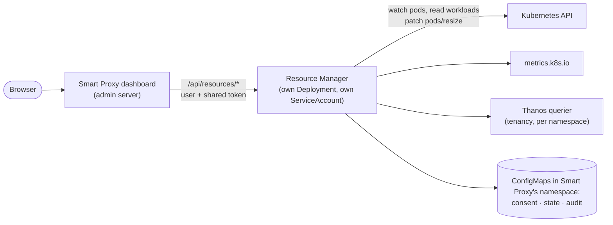

# Resource Manager — design

**Status: parked (October 2026). Nothing here is implemented.**

Parked because the target cluster doesn't let namespace admins use or grant `pods/resize` (`oc auth can-i patch pods --subresource=resize` says no), and there is no other way to change a running pod's resources (§2). It can resume if a cluster admin applies the two ClusterRoles of §9, tested on kind 1.33. Everything else here (spike results, decisions) still stands.

The Resource Manager lowers what a namespace pays for CPU by resizing running pods in place, only for workloads someone explicitly opted in from the dashboard. It is a separate subsystem: Smart Proxy's routing, sleep and wake work the same with it on or off.

## 1. Goal and non-goals

The cluster bills the **time-weighted monthly average of the limits of running pods**. Many applications (JVMs above all) need much more CPU to start than to run. Today their limits are sized for startup, all month long.

**Goal:** keep the template's limits for startup, then bring each pod's CPU limit down to what it needs, and back up when it needs more, with the In-Place Pod Resize (`pods/resize`, Kubernetes 1.33+, OpenShift 4.20+). The pod isn't restarted and the workload's template isn't touched.

**Non-goals:**
- Scale to zero and schedules: they stay with the proxy.
- Changing workload templates (Deployment, StatefulSet, DeploymentConfig): never, enforced by RBAC (§9).
- Applying memory changes: memory is only ever recommended.
- Anything cluster-scoped to install (CRDs, webhooks): it must work for namespace admins (but see §9 about `pods/resize`).

## 2. What a spike on a real cluster showed

kind with Kubernetes 1.33.4 (the version OpenShift 4.20 is based on). Each row decides part of the design.

| Check | Result | So |
| :--- | :--- | :--- |
| `pods/resize` subresource | present | Detect it with discovery, then a server-side dry-run resize. |
| Are `pods/resize` in the `admin`/`edit` roles? | **No.** A namespace admin can neither use nor grant it: creating a Role with it is refused as privilege escalation. `patch pods` doesn't help, since resources can only change through `pods/resize`. | **Blocker for Role-only installs**: one action by a cluster admin is needed (§9). First thing to check on OpenShift 4.20: `oc auth can-i patch pods --subresource=resize -n <ns>`. |
| Burstable pod: lower the CPU limit, requests unchanged | Applied at once; restarts stay 0; the cgroup follows. | The main lever. |
| Limit below the request | Refused (validation). | Either lower the request too, or never go below it (§6.4). |
| Guaranteed pod: change the limit only | Refused: *"Pod QOS Class may not change as a result of resizing"*. | Requests and limits move together. |
| Burstable → Guaranteed by accident | Refused, same reason. | Every plan is checked for its QoS class before it is sent. |
| `resizePolicy: RestartContainer` for CPU | The container is restarted. | Such containers are excluded. |
| The container restarts (crash, failed liveness probe) | **It keeps the resized values**: a JVM restarting in that pod starts with the lowered CPU. | **Boost again on every container restart** (§6.2), or a slow start can fail its probes and loop. |
| ResourceQuota | Usage follows the resized values (after the quota resync, seconds). | Lowering frees quota others can take; raising back can then be refused (§6.6). |
| LimitRange min/max | Enforced on resize. | Clamp before sending. |
| Server-side dry-run of a resize | Works. | Dry-run in the UI, and detection of support and permission. |

The pod's `spec` holds the desired resources; `status.containerStatuses[].resources` holds the applied ones. The `PodResizePending` (Deferred / Infeasible) and `PodResizeInProgress` conditions say how a resize is going.

## 3. Architecture

### Separate Deployment, same image (recommended)



`resourceManager.enabled: true` adds a Deployment running `smart-proxy resource-manager`: the same image with another command, so there is still a single image to mirror. It has its own ServiceAccount, Role and Lease. The proxy Deployment is unchanged except for one environment variable, which tells the dashboard where to find the Resource Manager.

Why not run it inside the proxy pods:
- **Least privilege.** The proxy pods receive internet traffic, so they shouldn't hold `pods/resize` on every namespace.
- **RBAC proves the promise.** The Resource Manager's role has no write verb on any workload, so "never modifies templates" doesn't rest only on code.
- **Independence.** Turning it on or off, upgrading it or a crash doesn't touch the proxy, and it can have its own resources.

The cost is one small Deployment (~20m CPU, ~64Mi) and a hop for the dashboard's calls.

### Packages

```
cmd/server                      unchanged entry point; "resource-manager" subcommand → internal/resources/app
internal/resources/
  app/        configuration, leader election (own Lease), wiring, HTTP server
  workload/   Kind interface + Deployment, StatefulSet, DeploymentConfig; pod → workload via ownerReferences
  observe/    metrics.k8s.io sampler, Thanos client, pod status (restarts, OOMKilled, startup timings)
  model/      decaying histograms, startup profiles, checkpoints
  policy/     recommendations and guardrails (bounds, LimitRange, quota, QoS, HPA, resizePolicy, JVM)
  actuate/    resize plans, idempotence, rate limits, verification, audit
  consent/    consent store, signatures, kill switch
  api/        HTTP API used by the dashboard
  savings/    savings accounting and Prometheus metrics
```

**Boundary:** `internal/resources/...` may import client-go and `internal/logger`, nothing else of Smart Proxy. No proxy package imports it either. A test (`go list -deps`) fails the build if either rule breaks. The dashboard only talks to it over HTTP: the admin server forwards `/api/resources/*` with the signed-in user (`X-Smart-Proxy-User`) and a token from a Secret both Deployments mount. The Resource Manager accepts nothing else.

**Workloads:** a `Kind` interface (`List`, `Get`, `PodTemplate`, `Owns(pod)`). Pods are matched through ownerReferences: Pod → ReplicaSet → Deployment, Pod → StatefulSet, Pod → ReplicationController → DeploymentConfig. A new kind only adds an implementation.

## 4. Consent, state and audit

Everything lives in ConfigMaps of Smart Proxy's namespace. CRDs would need a cluster admin, and a ConfigMap is enough at this size. Leader-only writes, optimistic concurrency.

**`<release>-resources-consent`, the only source of truth for what may be touched:**

```json
{
  "paused": false,
  "workloads": {
    "shop/Deployment/orders": {
      "uid": "6f1c…",
      "mode": "auto",
      "capabilities": ["startupDeboost", "cpuRightsizing"],
      "bounds": { "cpuMin": "200m", "cpuMax": "2" },
      "acknowledged": ["jvm-active-processor-count"],
      "by": "mario.rossi", "at": "2026-10-12T09:14:03Z",
      "signature": "…"
    }
  }
}
```

**Annotations don't count.** Annotations on a workload are never read, so adding one by hand or from Git enables nothing. Nothing is written on workloads either: there's nothing for Argo CD to see as drift.

**Hand-edited entries don't count either.** Each entry is signed with a key kept in the Resource Manager's Secret, so an entry added by editing the ConfigMap is ignored, and the UI says so.

**Bound to the workload's UID.** If the workload is deleted and created again, its consent is suspended until someone confirms it again.

**Modes:**

| Mode | Stores | Shows | Changes pods |
| :--- | :--- | :--- | :--- |
| *(none, default)* | nothing | requests/limits and live usage | no |
| `observe` | learns (histograms, startup profile) | + P95/P99, startup profile | no |
| `recommend` | learns | + recommendations, "what auto would do now" (dry-run) | no |
| `auto` | learns | everything | yes, only the enabled capabilities |

**Capabilities:** `startupDeboost` and `cpuRightsizing`. Memory has no capability, only recommendations.

**Revoke** (consent removed or mode lowered): every running pod of the workload goes back to the template's values via resize, at once. Pods that can't (quota taken meanwhile) are listed in the UI, with a button to recreate them.

**Kill switch:**
- In the UI it is stored in the same ConfigMap; in Helm it is `resourceManager.paused`, and Helm wins.
- It stops every action at once. A second button, "pause and restore", also brings every pod back to its template.

**Other state:**
- **`<release>-resources-state`:** learned models (histograms, startup profiles) and the month's savings counters, checkpointed every 5 minutes, so a restart or a new leader doesn't start from zero. It is size-capped.
- **`<release>-resources-audit`:** the latest 1000 actions. Each records what changed (pod, container, before → after), when, why (the numbers behind the decision), who (system or a user) and the result. **Undo** puts a pod back to its *before* values and holds the workload's automatic changes for 1 hour, or the loop would redo them.
- **Kubernetes Events:** each resize is also recorded as an Event on the pod, so `oc describe pod` tells the story.

## 5. Observation

**metrics.k8s.io.** The leader reads PodMetrics per namespace every 30 seconds, giving CPU and memory working set per container. This feeds:
- the live charts (2 hours in memory);
- the models of observed workloads.

**Thanos querier, OpenShift tenancy.** This is the port 9092 endpoint with a `namespace` parameter and the ServiceAccount token. At start and every hour it backfills 7 days at 5-minute resolution for observed workloads:
- CPU: `rate(container_cpu_usage_seconds_total[5m])` per pod and container;
- memory: `container_memory_working_set_bytes`;
- throttling: `rate(container_cpu_cfs_throttled_periods_total[5m]) / rate(container_cpu_cfs_periods_total[5m])`;
- pod lifecycle: `kube_pod_created`, `kube_pod_status_ready{condition="true"}`, `kube_pod_owner`, used to leave startup out of the steady state.

Throttling is also polled every minute for workloads in `auto`.

**Pod status:** restarts, OOMKilled (`lastState.terminated.reason`), and the creation → Ready times.

**Degraded mode, when Thanos isn't reachable:**
- metrics.k8s.io only, with the history kept in memory and checkpointed; the UI says so.
- Without a throttling signal, *CPU usage at ≥ 90% of the limit for 3 minutes* stands in for throttling.
- Automatic right-sizing needs a real throttling signal, so it stays off. Recommendations and de-boost still work, with a larger headroom.

**Model, per workload and container:**
- **Steady-state CPU:** a decaying histogram (exponential buckets, 7-day window), fed only by samples after Ready plus a margin.
- **Memory:** a histogram of peaks.
- **Startup profile:** the latest 20 starts, each with its time to Ready and its CPU during startup.

Before recommending anything, it needs at least 24 hours of steady-state data and 3 observed startups. The UI shows the learning progress meanwhile.

## 6. Decisions and guardrails

### 6.1 CPU target

`target = P99(steady state, 7 days, decaying) × (1 + headroom)`, with headroom 30% by default, rounded up to 10m. It is then clamped:
- **lower bound:** the highest of the workload's minimum (UI), the LimitRange minimum and the container's request (§6.4);
- **upper bound:** the lowest of the workload's maximum (UI), the LimitRange maximum, the `maxLimitRequestRatio` and **the template's limit**.

Never above the template by default: Smart Proxy can only lower the bill, never raise it.

### 6.2 Startup de-boost

1. A new pod starts with the template's values, which are the boost. This covers rollouts, evictions and a wake from zero by the proxy, with no coupling.
2. When the pod is Ready, plus a margin (2 minutes, or the startup profile's CPU tail if longer), its CPU limit goes down to the target.
3. **If a container restarts** (its restart count grows, or it isn't Ready any more), its CPU goes back to the template's value at once. The de-boost follows again after Ready.

### 6.3 Runtime right-sizing

Every 5 minutes, each pod's current limit is compared with the target:
- **Change:** only if they differ by more than 20% (hysteresis).
- **Limits per pod:** at most 4 changes an hour, and at least 10 minutes apart.
- **Throttling:** sustained throttling (more than 10% of periods throttled for 3 minutes) raises the limit at once, ignoring hysteresis and the interval, by ×1.5 up to the upper bound. It is recorded as a rollback.

### 6.4 Requests

- **Burstable pods: only limits move, requests never.** So a limit never goes below the request.
  - It keeps HPA (computed on requests) and scheduling unchanged.
  - Raising a limit never needs room on the node, since limits aren't part of scheduling, so a boost or a revoke can't be *Deferred*.
  - The savings are `template limit − max(request, target)`: for most applications, where requests are already close to steady usage, almost all of the possible saving.
- **Guaranteed pods: requests and limits move together**, because the QoS class can't change. Raising them back needs room on the node and can be *Deferred*. The confirmation dialog says so, and asks for an explicit OK.

### 6.5 Other guardrails

- **QoS:** the class is computed before and after each plan; a plan that changes it is never sent.
- **ResourceQuota:** lowering always fits. Raising checks `hard − used ≥ increase`; if it doesn't fit, the UI shows an alert and it is retried.
- **LimitRange:** min, max and `maxLimitRequestRatio`, per container, clamped before sending.
- **HPA:** a workload targeted by an HPA on CPU (`Resource` or `ContainerResource` cpu) can't get `cpuRightsizing`, and the UI shows the reason. The startup de-boost stays possible on Burstable pods, because it doesn't touch requests; on Guaranteed pods it is excluded too.
- **`resizePolicy`:** a container whose CPU policy is `RestartContainer` is excluded.
- **Infeasible resizes:** the `PodResizePending` reason `Infeasible` (e.g. the static CPU manager with exclusive CPUs) marks the container unsupported, with no retry loop.
- **Containers without a CPU limit:** left alone.
- **Init containers:** never touched.
- **JVM:**
  - **Detection:** an image or command containing `java`, `jdk` or `jre`, or a `JAVA_TOOL_OPTIONS`, `JAVA_OPTS` or `JDK_JAVA_OPTIONS` variable.
  - **Check:** whether `-XX:ActiveProcessorCount` is missing from the environment and the args. If so, the UI explains that the JVM sizes its GC threads and pools on the CPUs it sees at startup, and suggests the value to set.
  - **Gate:** the de-boost stays disabled until someone acknowledges the warning.
- **Cluster without resize support:** detected at start (discovery, then a dry-run). The capabilities switch themselves off and the UI explains why. Observation and recommendations still work.

### 6.6 How a change is made

- **Plan:** computed from the template, the consent and the model, then compared with the pod's spec. A request is sent only when they differ, so the same plan twice does nothing.
- **Patch:** only the container's `cpu` fields, through `pods/resize`.
- **Check:** the result is verified on the status and conditions.
- **On error:** retried with backoff, and recorded in the audit and as an Event.
- **Rate limit:** a global limit (e.g. 20 resizes a minute) keeps a burst of decisions from flooding the API.

## 7. Savings

**Accounting.** Every 30 seconds, for each managed container, Smart Proxy counts `template limit − applied limit` (from the status, not the spec) and adds it up as core-hours. Each is tagged as either de-boost or right-sizing.

**Billing's unit.** The cost is the time-weighted monthly average of limits, so:
- *Average cores less this month* = core-hours saved ÷ hours of the month so far.
- Euros = core-hours saved × price per core-hour.

**Where it shows:** monthly totals are kept in the state ConfigMap. Prices come from Helm (`pricing.cpuCoreHour`, `pricing.memoryGiBHour`, `currency`). `recommend` mode shows the *potential* saving.

**Prometheus metrics:**
- `smart_proxy_resources_limit_core_hours_saved_total{namespace,workload,reason}`
- `smart_proxy_resources_limit_gib_hours_saved_total{…}` (for when memory is applied; 0 today)
- `smart_proxy_resources_resizes_total{namespace,workload,action,result}`
- `smart_proxy_resources_rollbacks_total{…}` (throttling or restart raised a limit)
- `smart_proxy_resources_throttling_detected_total{…}`
- `smart_proxy_resources_managed_workloads{mode}`

## 8. UI

A **Resources** tab, separate from Routes, shown only when the Resource Manager is installed.

### List

**Header cards:**
- Resize support, and the reason when it's missing.
- Data source: Thanos, or metrics.k8s.io only.
- Kill switch.
- CPU limits now vs templates.
- Saved this month: core-hours, average cores, €.

**Table, grouped by namespace**, with these columns:
- workload (kind);
- CPU: template limit → applied now, P95/P99, target;
- memory: limit, P99, recommendation;
- mode badge;
- estimated saving per month;
- flags: HPA, JVM, Guaranteed, unsupported.

### Workload page

- **Access:** the mode and capabilities, and the bounds.
- **Confirmation dialog:** it spells out, with the real numbers, what will happen. For example: *"When an `orders` pod is Ready (+2m), its CPU limit goes from 2 to 700m; requests (500m) don't change. If its container restarts, it gets 2 back until Ready. Never above 2. Memory is never changed. The Deployment isn't changed: new pods start with 2."* It also lists the warnings that need an OK.
- **Charts:** CPU usage vs applied limit vs request, and memory vs limit (24 hours / 7 days).
- **Startup profile:** time to Ready, CPU during startup.
- **What auto would do now** (dry-run): the plan, per pod.
- **History**, with Undo.
- **Memory:** the recommendation with why (P99, OOMKills), plus snippets to copy for Helm values (`resources:`), the manifest and `oc set resources …`.

### API, served by the Resource Manager and proxied by the dashboard

| Call | Purpose |
| :--- | :--- |
| `GET /api/resources/status` | installed, resize supported (+ reason), data source, paused, prices, defaults |
| `GET /api/resources/workloads?namespace=` | the list above |
| `GET /api/resources/workloads/{ns}/{kind}/{name}` | detail: containers, model, recommendations, guardrails, plan, startup profile |
| `GET /api/resources/workloads/{ns}/{kind}/{name}/series?range=24h` | chart data |
| `PUT /api/resources/consent/{ns}/{kind}/{name}` | mode, capabilities, bounds, acknowledged warnings (records user and time) |
| `DELETE /api/resources/consent/{ns}/{kind}/{name}` | revoke: pods back to the template |
| `GET /api/resources/audit?namespace=&workload=` | history |
| `POST /api/resources/audit/{id}/undo` | undo one change |
| `PUT /api/resources/pause` | kill switch (`{paused, restore}`) |

## 9. RBAC and installation

```yaml
resourceManager:
  enabled: false
  paused: false              # kill switch; wins over the UI
  namespaces: []             # default: the proxy's namespaces
  thanos:
    url: https://thanos-querier.openshift-monitoring.svc:9092
    enabled: auto            # off on clusters without it
  defaults:
    window: 168h
    headroom: 0.3
    hysteresis: 0.2
    maxResizesPerHour: 4
    deboostMargin: 2m
  rbac:
    resize: false            # bind smart-proxy-pod-resize (a cluster admin applies it once, §9)
  pricing:
    cpuCoreHour: 0
    memoryGiBHour: 0
    currency: EUR
  resources: {}
```

**In each managed namespace:** a Role, or a ClusterRole for `allNamespaces` or a `namespaceSelector`.
- `pods` get/list/watch;
- `pods/resize` patch;
- `metrics.k8s.io` `pods` get/list;
- `deployments`, `replicasets`, `statefulsets` (apps), `deploymentconfigs` (apps.openshift.io), `replicationcontrollers`, `horizontalpodautoscalers`, `limitranges`, `resourcequotas`: get/list/watch;
- `events` create (optional, for the Events on pods).

No write verb on any workload. For Thanos tenancy: a RoleBinding to `view` in each managed namespace. `pods/resize` is granted only with `resourceManager.rbac.resize: true` (see below and §12).

**In Smart Proxy's namespace:**
- `configmaps`: its three, by name, plus create;
- `leases`: its own;
- `secrets`: its own key and the token shared with the dashboard.

**`pods/resize` for namespace admins.** Namespace admins can't use or grant it: checked on kind 1.33, and on the target OpenShift cluster (`oc auth can-i` says no). A cluster admin applies this once; we ship it as `deploy/kubernetes/pod-resize-clusterrole.yaml`:

```yaml
# The permission itself, bound to nobody.
apiVersion: rbac.authorization.k8s.io/v1
kind: ClusterRole
metadata:
  name: smart-proxy-pod-resize
rules:
  - apiGroups: [""]
    resources: [pods/resize]
    verbs: [patch]
---
# Lets namespace admins bind that one role (and nothing else) in their namespaces.
apiVersion: rbac.authorization.k8s.io/v1
kind: ClusterRole
metadata:
  name: smart-proxy-pod-resize-binder
  labels:
    rbac.authorization.k8s.io/aggregate-to-admin: "true"
rules:
  - apiGroups: [rbac.authorization.k8s.io]
    resources: [clusterroles]
    verbs: [bind]
    resourceNames: [smart-proxy-pod-resize]
```

**Tested on kind 1.33 (namespace admin = the `admin` role):**
- The namespace admin can bind `smart-proxy-pod-resize` to the Resource Manager's ServiceAccount, and the ServiceAccount can then resize pods.
- The namespace admin still can't resize pods, can't create a Role with `pods/resize`, and can't bind any other cluster role.

**Then:** `resourceManager.rbac.resize: true` makes the chart create that RoleBinding in each managed namespace. It is a namespace admin's install, with no cluster admin each time.

**What the platform team should know:**
- The resize permission is given only to who a namespace admin binds it to, in their own namespace, and is visible as a RoleBinding.
- An admin could also bind it to a person.
- It allows changing the CPU and memory of running pods, which they can already do by editing their workloads. It grants nothing beyond that.

**Without this manifest,** the Resource Manager works in `observe` and `recommend`, and the UI explains why `auto` isn't available and what to ask for.

The alternative, aggregating `patch pods/resize` directly into `admin`, also works, but gives every namespace admin the permission whether they use Smart Proxy or not.

## 10. Tests

**Unit tests,** with a fake clientset and a fake clock:
- the workload chains, DeploymentConfig through ReplicationController included;
- QoS preservation (refused plans);
- hysteresis and the rate limits;
- bounds, LimitRange (min/max/ratio), quota;
- HPA exclusion, `resizePolicy`, JVM detection;
- re-boost on container restart;
- consent: signatures, UID, ignored annotations;
- revoke, the kill switch, undo;
- the histograms and savings accounting;
- the Thanos client against an `httptest` server;
- the API;
- the import-boundary test.

**E2E on kind 1.33** (kind 0.30, node `v1.33.4`, plus metrics-server). The whole e2e suite moves to 1.33. The test app burns CPU for its first seconds, then idles. The scenarios:
- **De-boost:** applied after Ready, restart count still 0, the template unchanged.
- **Container restart:** a killed container gets its CPU back, then is de-boosted again.
- **Right-sizing:** with short windows set by environment.
- **Revoke and kill switch:** pods go back to the template.
- **No consent:** a workload without consent is never touched, even with a hand-written annotation or ConfigMap entry.
- **Proxy suite:** the existing scenarios pass with the Resource Manager both on and off.

Thanos isn't in kind: e2e runs the degraded mode, and the Thanos client is covered by unit tests.

## 11. Phases (one commit or more each, tests green at each step)

1. **Observation, recommendations, read-only UI**
   - the Deployment, the read-only RBAC, the dashboard proxy;
   - workloads, metrics.k8s.io, Thanos, models and checkpoints;
   - CPU and memory recommendations, guardrail analysis, resize-support detection;
   - modes `observe` and `recommend`;
   - the Resources tab and the workload page, including memory snippets.

   No code that changes pods yet.
2. **Consent and startup de-boost**
   - signed consent and the confirmation dialog;
   - the actuation engine: QoS, LimitRange, quota, rate limits, verification;
   - re-boost on restart, revoke, the kill switch;
   - audit with undo, dry-run;
   - `pods/resize` RBAC, e2e.
3. **CPU right-sizing:** hysteresis, raise on throttling, HPA exclusion, bounds in the UI, e2e.
4. **Savings and polish**
   - accounting, euros, Prometheus metrics;
   - `docs/resources.md`, configuration, installation, CHANGELOG;
   - screenshots;
   - release.

## 12. Decisions

1. **Billing follows the pod's spec**, which a resize changes (expected, not yet checked). After the first resize, the Resource Manager reads `kube_pod_container_resource_limits` from Thanos for that pod and shows whether it reflects the new limit, so this is verified on the real cluster, not assumed.
2. **`pods/resize` permission: namespace admins don't have it** (checked on the target cluster). The chart doesn't grant it by default (`resourceManager.rbac.resize: false`), so a namespace admin's `helm upgrade` can't fail on privilege escalation. Once a cluster admin has applied the manifest of §9, `rbac.resize: true` binds it. The Resource Manager checks its permission at start (SelfSubjectAccessReview); until it has it, `auto` is unavailable and the UI says what to ask. Phase 1 doesn't need it at all.
3. **HPA on CPU:** right-sizing is excluded; the de-boost stays, because on Burstable pods it changes limits only and the HPA works on requests. On Guaranteed pods the de-boost would move requests too, so it is excluded there as well.
4. **Kill switch:** both "pause" and "pause and restore".
5. **Workloads without consent:** all listed, read-only, with their template values and live usage; nothing is learned or stored for them.
6. **Defaults:**
   - headroom 30%, window 7 days, hysteresis 20%;
   - at most 4 changes per hour per pod, 10 minutes apart;
   - de-boost after Ready + 2 minutes;
   - 24 hours of data and 3 startups before acting;
   - after an undo, automatic changes are held for 1 hour.

   All of them can be changed in Helm.
7. **Architecture:**
   - a separate Deployment, same image (§3);
   - never above the template's limit;
   - on Burstable pods, limits only (§6.4).
8. **Prices:** 0 by default. The UI then shows core-hours and average cores only, and euros once a price is set.
9. **Thanos tenancy:** the chart binds the `view` ClusterRole to the Resource Manager in each managed namespace (a namespace admin can grant it). If Thanos still refuses, it runs degraded and says why.

## 13. Alternatives considered

**Vertical Pod Autoscaler** (`InPlaceOrRecreate`, VPA 1.4+):
- it needs CRDs and an admission webhook, installed cluster-wide, which isn't possible as namespace admins;
- its configuration lives in custom resources, which conflict with GitOps;
- it has no startup boost.

**Lowering the limits in Git:** it restarts the pods, and loses the startup CPU.

**Startup-boost operators** (e.g. kube-startup-cpu-boost): a cluster-wide webhook, the same problem as VPA.
