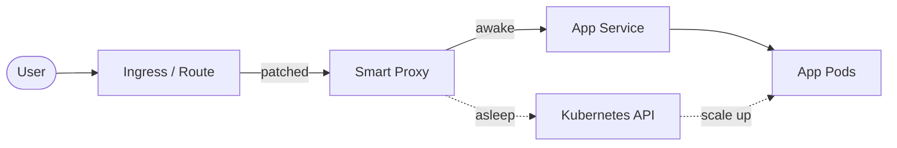

---
hide:
  - navigation
  - toc
---

<p align="center">
  
</p>

<h1 align="center" style="margin-bottom:0">Smart Proxy</h1>

<p align="center" style="font-size:1.25rem"><strong>Scale-to-zero and smart traffic management for Kubernetes &amp; OpenShift — <em>without touching your apps.</em></strong></p>

<p align="center">
  <a href="installation/" class="md-button md-button--primary">Get started</a>
  <a href="https://github.com/ivseb/smart-proxy" class="md-button">View on GitHub</a>
</p>

<p align="center">
  
</p>

---

## Why Smart Proxy?

Idle environments burn money. Preview, dev, staging and demo namespaces run 24/7 while nobody looks at them — and most apps can't scale to zero on their own.

**Smart Proxy fixes that.** It sits in front of your services, puts inactive Deployments to **sleep (0 replicas)**, and **wakes them on the first request** — showing a friendly "waking up" page while the pod starts. It works by patching your *existing* Ingress or Route: **no sidecars, no rewrites, no code changes**. Turn it off and everything reverts.

## What you get

<div class="grid cards" markdown>

-   :material-power-sleep:{ .lg .middle } &nbsp; __Auto-sleep & instant wake__

    ---

    Scale idle deployments to zero and wake them transparently on the next request — a "waking up" page bridges the gap.

-   :material-link-variant:{ .lg .middle } &nbsp; __Dependency chains__

    ---

    Keep `app → api → db` awake together and let them sleep together. Traffic to one keeps the whole chain alive.

-   :material-sitemap:{ .lg .middle } &nbsp; __Ingress *and* Routes__

    ---

    Manage vanilla Kubernetes Ingresses and OpenShift Routes from a single, unified dashboard.

-   :material-view-dashboard:{ .lg .middle } &nbsp; __Admin dashboard__

    ---

    A modern React UI with real-time logs, live status indicators and one-click patching.

-   :material-feather:{ .lg .middle } &nbsp; __Zero app changes__

    ---

    Annotation-based and fully reversible. Nothing to add to your images or your code.

-   :material-cash-multiple:{ .lg .middle } &nbsp; __Real cost savings__

    ---

    Stop paying for preview, dev, staging and demo environments while they sit unused.

</div>

## How it works

!!! info "In four steps"

    1. **Patch** a route from the dashboard — Smart Proxy points the Ingress/Route to itself (originals saved in annotations).
    2. **Serve** — incoming traffic hits Smart Proxy, which checks the target's state.
    3. **Wake** — if the deployment is asleep, it holds the request, scales it up, and shows a "waking up" page until ready.
    4. **Sleep** — after an idle timeout with no traffic, it scales the deployment back to zero.



[Read the full architecture →](architecture.md)

## Get started

<div class="grid cards" markdown>

-   :material-rocket-launch:{ .lg .middle } &nbsp; __Install__

    ---

    Deploy with Helm in two commands, or run it locally with Docker Desktop.

    [:octicons-arrow-right-24: Installation guide](installation.md)

-   :material-tune:{ .lg .middle } &nbsp; __Configure__

    ---

    Environment variables, annotations and Helm values reference.

    [:octicons-arrow-right-24: Configuration](configuration.md)

</div>

```bash
helm repo add smart-proxy https://ivseb.github.io/smart-proxy
helm install smart-proxy smart-proxy/smart-proxy --namespace smart-proxy --create-namespace
```
